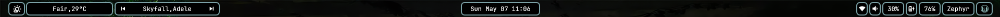
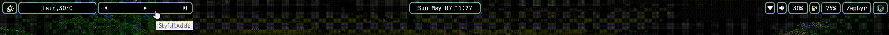

# Zephyrize
A minimal aesthetic rainmeter bar 

## Requirements:
  - [Rainmeter](https://www.rainmeter.net/)
  
## Features:
  - Weather
  - Spotify media controls (with song info)
  - Clock
  - Wi-Fi status
  - Audio status/controls (volume, output devices)
  - Battery status

## Installation:
  1. Download the latest [release](https://github.com/ZephyrY7/Zephyrize/releases)
  2. Install the skin by double clicking on the downloaded .rmskin
  
## Credits:
  - Inspiration from [eww](https://github.com/elkowar/eww)
  - Weather parser by [Catppuccin Rainmeter skin](https://www.deviantart.com/dule23/art/Catppuccin-Rainmeter-skin-914252677)
